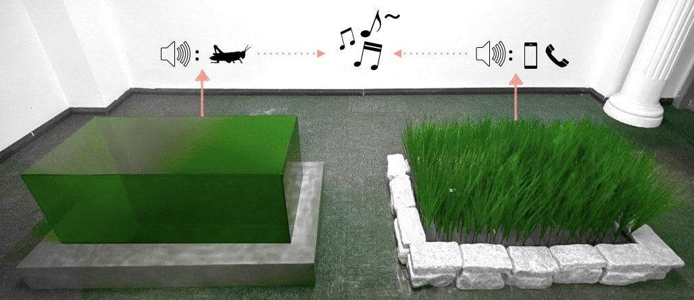
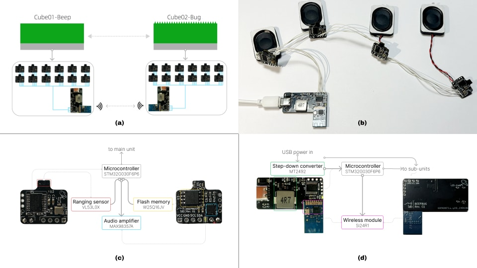

# BeepBug

🚧 Final touches are work-in-progress, ETA spring 2024

*BeepBug* is an interactive art installation, the thematic idea being that harmony between the artificial and the natural environment will supplant opposition.

The work comprises two sound-emitting cubes (or what could be perceived as shrubs), which aim to draw the audience’s attention to the delicate interconnections between naturality and artificiality. This central idea is manifested in intertextual relationships formed simultaneously in the auditory, the visual, and the cognitive domain.

